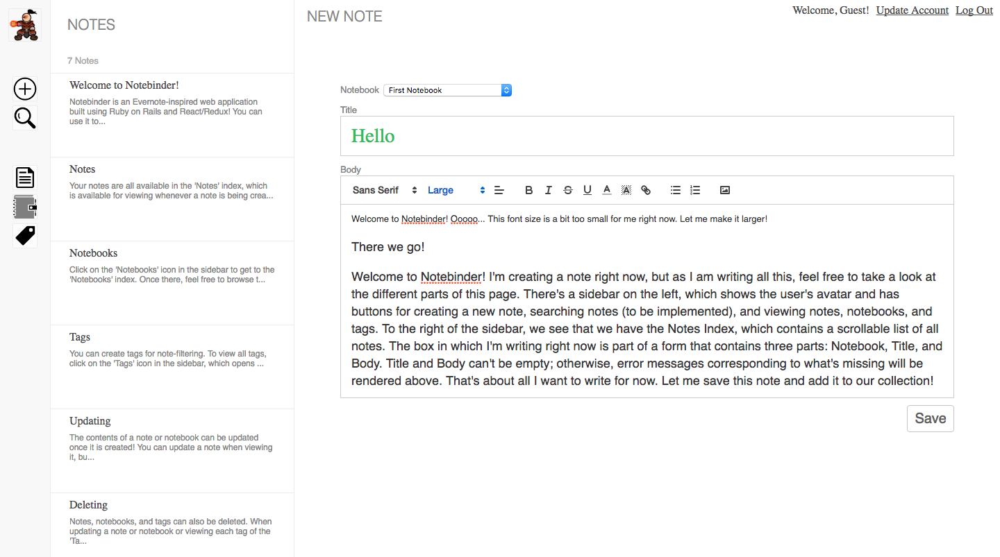

# Notebinder

[Notebinder live][heroku]

[heroku]: http://notebinder.herokuapp.com

Notebinder is an Evernote-inspired full-stack web application built using Ruby on Rails on the backend and React.js on the frontend, with a Redux architectural framework. It utilizes a PostgreSQL database to store data.

## Features and Implementation

## Auth

Before a user can create a new note, he/she must either create an account or sign in. Both of these are rendered using the `AuthForm` component. When an account is created or an existing user signs in, an API call is made to the database, which creates a session for the user. Users are stored in a table which consists of columns for `id`, `full_name`, `email`, `username`, `password_digest`, `session_token`, `created_at`, and `updated_at` (Various columns that the Paperclip library utilizes to upload files are also included). Note that user passwords are never stored; rather, a `password_digest` is created using the BCrypt gem when the user creates an account and verified when he/she signs in.

Upon successful signin, the user will be given a `session_token`. The user is also bootstrapped so that he/she remains logged on upon a page refresh. If the app detects that a user is signed in when a page loads, it will redirect him/her to a page where he/she can create a note.

## Notes

There are several components handling notes: `NotesIndex`, `NewNote`, and `Note`. `NotesIndex` renders a scrollable list containing a preview of each note, and is a parent the latter two. `NewNote` renders a form for creating a new note, while `Note` renders a form containing a note's contents and options for updating it.

Below is a screenshot of the path `/notes/new`, which corresponds to `NewNote`.

Notice that there is a sidebar. The component that renders it is `Sidebar`, a subcomponent of `Home`. `Home` is a parent component of `NotesIndex` and is an ancestor of all the components that will be mentioned from now on (i.e. `Home` "houses" all of those components).

You may also have noticed that rich-text editing is available for a note's body. This feature has been implemented using the library ReactQuill for enhanced user experience.

On the database side, notes are stored in a table consisting of the following columns: `title`, `body`, `notebook_id`, `created_at`, and `updated_at`. Each note belongs to a notebook, and the association between the two is created using `notebook_id`.

## Notebooks

Several components handle notebooks as well: `NotebooksIndex`, `NewNotebook`, `NotebookNotesIndex`, and `NotebookUpdate`. `NotebooksIndex` renders a list containing previews of each notebook. Upon clicking on one of the list elements, the component is unmounted and `NotebookNotesIndex` is mounted; this component renders a list of note previews for the chosen notebook. Clicking on a note preview will render the note itself (i.e. mount the `Note` component).

`NewNotebook` and `NotebookUpdate` are children of `NotebooksIndex` that, when mounted (by clicking on the 'New Notebook' button / an 'Update Notebook Details' button), render forms for creating and updating a notebook, respectively. Note that the Notebook Update page contains a warning: 'Deleting a notebook will delete all of its notes as well'. (This occurs in the backend, and takes advantage of the association mentioned earlier between the tables `notes` and `notebooks`).

The `notebooks` table on the database side contains the columns `title`, `description`, and `author_id`. Each notebook belongs to an author (i.e. a User object). Through the `notebooks` table, each Note object is also associated with an author.

## Tags

Like notes and notebooks, tags also have a `TagsIndex` handling them. `TagsIndex` contains a list of tags that, when clicked, will unmount `TagsIndex` and mount `TaggedNotesIndex`, which renders a list of previews of notes that have that chosen tag. Clicking on a note preview, as one might expect, mounts `Note` and renders the note's contents.

`TagsIndex` has a child `NewTag`, which renders a simple form for creating a new tag without associating it with a note. However, it is also possible to create a new tag in a note, which will associate it with that note; `NewTag` is also a child of `Note` for all React routes. `Tags`, a subcomponent of `Note`, handles the rendering of tags for it.

On the database side, two tables have been created to handle tags. Since notes can have MANY tags and tags can have MANY notes, creating a `tags` table is not enough. Thus, a join table, `taggings`, has been added.

The `tags` table consists of `id` and `name` columns, while the `taggings` table consists of `id`, `note_id`, and `tag_id` columns. Through `taggings`, associations have been created corresponding to the many-to-many relationship mentioned earlier. This is what allows the app to get the tags of a given note and get the notes that have the a given tag, and upon destruction of a tag, disconnect the tag from its notes.

## Account Update

The 'Account Update' page can be accessed via a link on the upper-right corner of the page. It is rendered using the `AccountUpdate` component. On the page, the user can update his/her full name and email, and also upload an avatar. Avatar uploading is implemented using the Paperclip library mentioned earlier and Amazon Web Services. Once a user updates his/her details, he/she will be redirected to the path `/notes/new`, where he/she can see his updated avatar on the top of the sidebar and an updated welcome message on the upper-right of the page.

## To Be Implemented

### Note Creation Through NotebookNotesIndex

Users will be able to create a note through `NotebookNotesIndex`. The value of the Notebook selector on the 'New Note' page will be pre-selected when the `NewNote` component mounts.

### Note Search

Users will be able to search for notes. While entering search criteria in the search bar, the list of notes that match the input will re-render, so that the search results update as each character is inputted.

### Notebook Search

In addition to searching through notes, users will also be able to search through notebooks.
